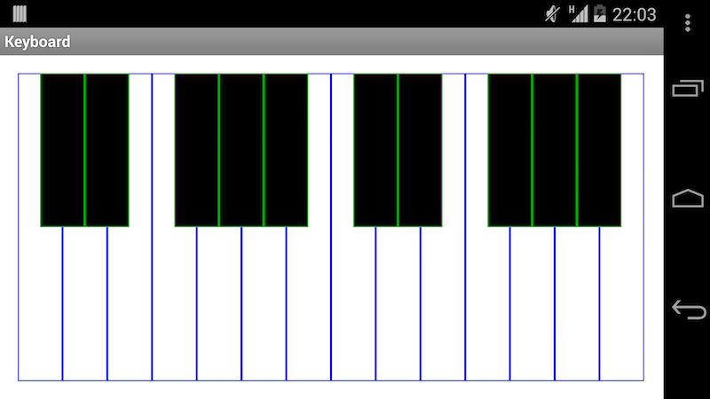

AndroidPianoView
================

A custom View for Android which displays a piano keyboard. I built and released this library to help developers who are making music applications and do not want to implement their own piano.



The PianoView can be either defined in XML or programmatically:

```xml
<com.twobard.pianoview.Piano 
    android:layout_width="fill_parent"
    android:layout_height="fill_parent"
    piano:keyCount="24"
    piano:blackKeyDrawable="@drawable/key_black_custom"
    piano:whiteKeyDrawable="@drawable/key_white_custom"
/> 
```


```java
Piano = new Piano(this, R.id.white_button, R.id.black_button, 24);
layout.addView(piano);
```


Remember to add the project as a library project.

